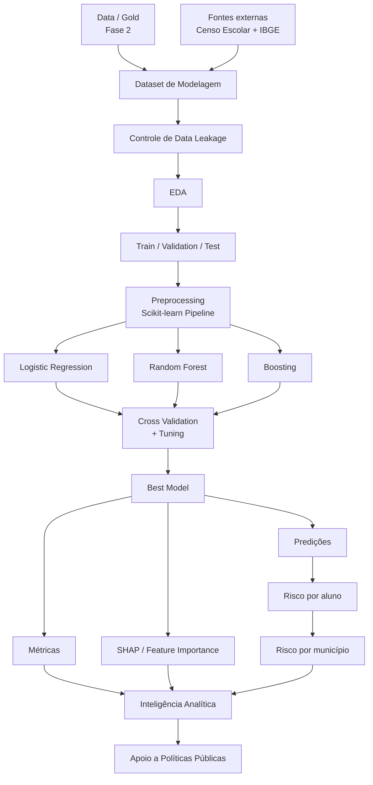

# FIAP Tech Challenge — Pipeline Medallion Local para Dados de Alfabetização

## 1. Visão geral

Este projeto implementa uma arquitetura de dados do tipo **Medallion Architecture**, organizada nas camadas **Bronze, Silver e Gold**, utilizando dados oficiais da **Avaliação da Alfabetização do INEP**.

A proposta é simular localmente uma arquitetura de Data Lake / Lakehouse, sem depender de GCP, BigQuery ou outra plataforma de nuvem para armazenar os dados processados.

A ingestão parte da **fonte institucional oficial do INEP**, os dados são preservados e amostrados na camada Bronze, tratados na camada Silver e transformados em datasets analíticos na camada Gold.

O diretório utilizado neste projeto é:

```text
G:\Meu Drive\FIAP\AI_Scientist\Fase3\techallenge1
```

A arquitetura implementada segue o fluxo:

```text
Fonte oficial INEP
        |
        v
+----------------------+
|       BRONZE         |
| dados brutos / raw   |
| amostras em CSV      |
+----------+-----------+
           |
           | limpeza, padronização,
           | tipos, chaves e qualidade
           v
+----------------------+
|       SILVER         |
| dados tratados       |
| dados padronizados   |
+----------+-----------+
           |
           | indicadores, metas,
           | gaps, rankings e evolução
           v
+----------------------+
|        GOLD          |
| datasets analíticos  |
| BI / EDA / ML        |
+----------------------+
```

---

# 2. Objetivo do projeto

O objetivo é construir uma pipeline de dados capaz de:

- coletar dados educacionais diretamente da fonte primária;
- preservar os arquivos institucionais originais;
- gerar amostras reprodutíveis para desenvolvimento e testes;
- organizar os dados em arquitetura Bronze, Silver e Gold;
- aplicar regras de limpeza e qualidade;
- padronizar identificadores e tipos;
- produzir datasets analíticos;
- comparar resultados de alfabetização com metas;
- analisar a evolução de 2023 para 2024;
- gerar bases adequadas para dashboards, análise estatística e Machine Learning.

O projeto utiliza dados relacionados a:

- resultados de alfabetização do Brasil e das UFs;
- resultados e metas por município;
- microdados de alunos da Avaliação da Alfabetização;
- proficiência em Língua Portuguesa;
- indicador oficial de alfabetização;
- metas anuais de 2024 a 2030;
- percentual de participação.

---

# 3. Fonte dos dados

A fonte primária utilizada é o **Instituto Nacional de Estudos e Pesquisas Educacionais Anísio Teixeira — INEP**.

Página institucional usada pelo pipeline:

```text
https://www.gov.br/inep/pt-br/areas-de-atuacao/avaliacao-e-exames-educacionais/avaliacao-da-alfabetizacao/resultados/2024
```

Arquivos esperados:

```text
resultados_e_metas_ufs_2024_2.xlsx
resultados_e_metas_municipios_2024.xlsx
microdados_avaliacao_da_alfabetizacao_2024.zip
```

Os arquivos baixados são preservados em:

```text
Bronze\_originais
```

Isso permite manter uma cópia local da fonte institucional sem aplicar transformações sobre os arquivos originais.

---

# 4. Estrutura do projeto

A estrutura esperada é:

```text
techallenge1
|
|-- Bronze
|   |-- _originais
|   |   |-- resultados_e_metas_ufs_2024_2.xlsx
|   |   |-- resultados_e_metas_municipios_2024.xlsx
|   |   |-- microdados_avaliacao_da_alfabetizacao_2024.zip
|   |   `-- microdados_extraidos
|   |
|   |-- bronze_brasil_ufs.csv
|   |-- bronze_municipios.csv
|   |-- bronze_alunos_5000.csv
|   `-- _manifesto_fontes.csv
|
|-- Silver
|   |-- silver_alunos.csv
|   |-- silver_ufs.csv
|   |-- silver_municipios.csv
|   `-- _relatorio_qualidade.csv
|
|-- Gold
|   |-- gold_indicadores_municipios.csv
|   |-- gold_indicadores_ufs.csv
|   |-- gold_amostra_alunos.csv
|   |-- gold_evolucao_temporal_municipal.csv
|   |-- gold_resumo_municipal_por_uf.csv
|   `-- _resumo_gold.csv
|
|-- logs
|   `-- pipeline.log
|
|-- src
|   |-- __init__.py
|   |-- config.py
|   |-- common.py
|   |-- bronze.py
|   |-- silver.py
|   |-- gold.py
|   `-- inspect_schema.py
|
|-- .venv
|-- requirements.txt
|-- run_pipeline.py
|-- README.md
`-- .gitignore
```

---

# 5. Arquitetura Medalhão

## 5.1 Bronze

A camada Bronze representa os dados mais próximos possível da fonte original.

Responsabilidades:

- acessar a fonte institucional do INEP;
- localizar os links oficiais;
- baixar os arquivos;
- preservar os arquivos originais;
- extrair o ZIP de microdados;
- identificar o arquivo tabular principal;
- gerar amostras em CSV;
- registrar informações sobre a origem dos dados.

Arquivos gerados:

```text
Bronze\bronze_brasil_ufs.csv
Bronze\bronze_municipios.csv
Bronze\bronze_alunos_5000.csv
Bronze\_manifesto_fontes.csv
```

### Amostragem

O projeto utiliza:

```python
SAMPLE_SIZE = 5000
RANDOM_SEED = 42
```

Isso significa que:

- tabelas com até 5.000 registros são mantidas integralmente;
- tabelas com mais de 5.000 registros são reduzidas para uma amostra;
- a amostra é reproduzível devido ao uso do `RANDOM_SEED = 42`.

Nos microdados dos alunos, o arquivo é lido em blocos para evitar que todo o dataset seja carregado na memória ao mesmo tempo.

A configuração usada é:

```python
CHUNK_SIZE = 100_000
```

Para cada bloco são atribuídas chaves aleatórias e o pipeline conserva as 5.000 menores chaves aleatórias encontradas ao longo de todo o arquivo.

Isso permite obter uma amostra aleatória com consumo de memória reduzido.

---

# 6. Camada Silver

A Silver recebe os CSVs da Bronze e aplica regras explícitas de tratamento.

Arquivos gerados:

```text
Silver\silver_alunos.csv
Silver\silver_ufs.csv
Silver\silver_municipios.csv
Silver\_relatorio_qualidade.csv
```

Principais transformações:

- renomeação das colunas;
- padronização de nomes;
- remoção de colunas vazias criadas pelo Excel;
- tratamento de strings;
- padronização da sigla da UF;
- normalização de códigos;
- tratamento de valores numéricos;
- conversão de tipos;
- remoção de duplicidades;
- validação de campos binários;
- validação de percentuais entre 0 e 100;
- criação de relatório de qualidade.

---

# 7. Padronização das variáveis

## 7.1 Microdados dos alunos

Mapeamento principal:

| Campo Bronze | Campo Silver |
|---|---|
| NU_ANO_AVALIACAO | ano_avaliacao |
| CO_UF | codigo_uf |
| SG_UF | sigla_uf |
| ID_ALUNO | id_aluno |
| TP_SERIE | tipo_serie |
| ID_ESCOLA | id_escola |
| TP_DEPENDENCIA | tipo_dependencia |
| CO_MUNICIPIO | codigo_municipio |
| NO_MUNICIPIO | nome_municipio |
| IN_PRESENCA_LP | presenca_lp |
| IN_PREENCHIMENTO_LP | preenchimento_lp |
| CO_CADERNO_LP | codigo_caderno_lp |
| VL_PESO_ALUNO_LP | peso_aluno_lp |
| VL_PROFICIENCIA_LP | proficiencia_lp |
| IN_ALFABETIZADO | alfabetizado |

---

## 7.2 Brasil e UFs

Mapeamentos principais:

| Campo Bronze | Campo Silver |
|---|---|
| ANO DA AVALIAÇÃO | ano_avaliacao |
| CÓDIGO UF | codigo_uf |
| SIGLA UF | sigla_uf |
| NOME UF | nome_uf |
| REDE | rede |
| PERCENTUAL ... 2023 | pct_alfabetizados_2023 |
| PERCENTUAL ... 2024 | pct_alfabetizados_2024 |
| META 2024 (2) | meta_2024 |
| META 2025 | meta_2025 |
| META 2026 | meta_2026 |
| META 2027 | meta_2027 |
| META 2028 | meta_2028 |
| META 2029 | meta_2029 |
| META 2030 | meta_2030 |
| PERCENTUAL DE PARTICIPAÇÃO | pct_participacao |

---

## 7.3 Municípios

Mapeamentos principais:

| Campo Bronze | Campo Silver |
|---|---|
| CÓDIGO UF | codigo_uf |
| SIGLA UF | sigla_uf |
| CÓDIGO MUNICÍPIO | codigo_municipio |
| NOME DO MUNICÍPIO | nome_municipio |
| REDE | rede |
| PERCENTUAL ... 2023 | pct_alfabetizados_2023 |
| PERCENTUAL ... 2024 | pct_alfabetizados_2024 |
| META 2024 (2) | meta_2024 |
| META 2025 | meta_2025 |
| META 2026 | meta_2026 |
| META 2027 | meta_2027 |
| META 2028 | meta_2028 |
| META 2029 | meta_2029 |
| META 2030 | meta_2030 |
| NIVEL ALFABETIZAÇÃO | nivel_alfabetizacao |
| PERCENTUAL DE PARTICIPAÇÃO | pct_participacao |

---

# 8. Qualidade de dados

O arquivo:

```text
Silver\_relatorio_qualidade.csv
```

registra verificações realizadas durante o processamento.

Entre elas:

- quantidade de valores nulos;
- duplicatas encontradas e removidas;
- validação de indicadores binários;
- validação de percentuais na faixa de 0 a 100;
- consistência básica de tipos.

Nos microdados são validados como binários:

```text
presenca_lp
preenchimento_lp
alfabetizado
```

Os valores esperados são:

```text
0
1
```

Nos campos percentuais, a faixa esperada é:

```text
0 <= percentual <= 100
```

---

# 9. Camada Gold

A camada Gold contém datasets preparados para análise.

Ela não representa simplesmente uma cópia da Silver.

Aqui são criados indicadores derivados e estruturas voltadas ao consumo analítico.

Arquivos gerados:

```text
Gold\gold_indicadores_municipios.csv
Gold\gold_indicadores_ufs.csv
Gold\gold_amostra_alunos.csv
Gold\gold_evolucao_temporal_municipal.csv
Gold\gold_resumo_municipal_por_uf.csv
Gold\_resumo_gold.csv
```

---

# 10. Gold — Indicadores municipais

Arquivo:

```text
Gold\gold_indicadores_municipios.csv
```

Principais variáveis derivadas:

### Variação 2023–2024

```text
variacao_2023_2024_pp
```

Cálculo:

```text
pct_alfabetizados_2024
-
pct_alfabetizados_2023
```

Interpretação:

- valor positivo: melhora;
- valor negativo: queda;
- valor zero: estabilidade.

---

### Gap da meta de 2024

```text
gap_meta_2024_pp
```

Cálculo:

```text
pct_alfabetizados_2024
-
meta_2024
```

Interpretação:

- positivo: resultado acima da meta;
- negativo: resultado abaixo da meta.

---

### Cumprimento da meta

```text
atingiu_meta_2024
```

Regra:

```text
1 = atingiu ou superou a meta
0 = não atingiu a meta
```

---

### Ranking municipal

São criados:

```text
ranking_amostra_brasil_2024
ranking_amostra_uf_2024
```

Importante:

O dataset municipal utilizado na Bronze possui uma amostra de até 5.000 registros.

Portanto, os rankings municipais produzidos são rankings **dentro da amostra** e não devem ser apresentados como ranking oficial de todos os municípios brasileiros.

---

# 11. Gold — Indicadores das UFs

Arquivo:

```text
Gold\gold_indicadores_ufs.csv
```

Contém:

- resultado de alfabetização de 2023;
- resultado de alfabetização de 2024;
- variação 2023–2024;
- meta de 2024;
- gap para a meta;
- indicador de cumprimento da meta;
- metas até 2030;
- participação;
- ranking entre UFs.

Variável de ranking:

```text
ranking_ufs_2024
```

---

# 12. Gold — Alunos

Arquivo:

```text
Gold\gold_amostra_alunos.csv
```

A camada Gold mantém a amostra individual dos alunos e cria indicadores adicionais.

Principais campos:

```text
proficiencia_lp
alfabetizado_oficial
alfabetizado_calculado_743
divergencia_indicador_743
```

O projeto utiliza o ponto de corte:

```text
743 pontos
```

A variável:

```text
alfabetizado_calculado_743
```

é calculada pela regra:

```text
proficiencia_lp >= 743
```

Resultado:

```text
1 = alfabetizado pelo critério de proficiência
0 = abaixo do corte
```

A variável:

```text
divergencia_indicador_743
```

compara o indicador calculado com o indicador oficial presente no microdado.

Isso permite verificar consistência entre:

```text
IN_ALFABETIZADO
```

e:

```text
VL_PROFICIENCIA_LP >= 743
```

---

# 13. Gold — Evolução temporal

Arquivo:

```text
Gold\gold_evolucao_temporal_municipal.csv
```

A estrutura é transformada para formato longo.

Exemplo conceitual:

| Município | Ano | Percentual alfabetizados |
|---|---:|---:|
| Município A | 2023 | 55.2 |
| Município A | 2024 | 61.8 |
| Município B | 2023 | 60.1 |
| Município B | 2024 | 64.7 |

Essa estrutura facilita:

- gráficos de evolução;
- dashboards;
- séries temporais;
- análises comparativas;
- modelos analíticos.

---

# 14. Gold — Resumo por UF

Arquivo:

```text
Gold\gold_resumo_municipal_por_uf.csv
```

Indicadores calculados:

```text
municipios_na_amostra
media_pct_alfabetizados_2023
media_pct_alfabetizados_2024
media_variacao_2023_2024_pp
media_gap_meta_2024_pp
pct_municipios_atingiram_meta_2024
media_participacao
```

Esse dataset é particularmente útil para:

- dashboards executivos;
- comparação regional;
- análise de desigualdade educacional;
- visualizações por estado.

---

# 15. Descrição dos códigos

## `src/config.py`

Responsável pelas configurações globais.

Principais parâmetros:

```python
BASE_DIR
BRONZE_DIR
SILVER_DIR
GOLD_DIR
LOG_DIR
ORIGINAL_DIR
```

Também define:

```python
SAMPLE_SIZE = 5000
RANDOM_SEED = 42
CHUNK_SIZE = 100_000
ALFABETIZACAO_CUTOFF = 743
```

---

## `src/common.py`

Contém funções reutilizadas pelos outros módulos.

Entre elas:

```text
setup_logging()
normalize_name()
normalize_columns()
clean_strings()
sample_df()
detect_encoding_and_separator()
read_csv_robust()
to_numeric_when_safe()
find_column()
write_csv()
```

Uma função importante é:

```python
detect_encoding_and_separator()
```

Ela tenta detectar corretamente o encoding dos arquivos CSV/TXT.

A ordem utilizada é:

```text
UTF-8
  |
  v
CP1252
  |
  v
Latin-1
```

Essa lógica foi implementada porque os arquivos do INEP podem conter caracteres acentuados.

---

## `src/bronze.py`

Responsável pela ingestão.

Principais etapas:

```text
discover_official_links()
        |
        v
download()
        |
        v
workbook_to_dataframe()
        |
        v
find_largest_tabular_file()
        |
        v
random_sample_large_csv()
        |
        v
run_bronze()
```

### `discover_official_links()`

Lê a página institucional do INEP e procura links para:

- Brasil/UFs;
- municípios;
- microdados.

### `download()`

Baixa os arquivos da fonte.

Possui:

- tentativas automáticas;
- timeout;
- arquivo temporário `.part`;
- espera progressiva entre tentativas;
- reaproveitamento de arquivos já existentes.

Se o arquivo já existir em:

```text
Bronze\_originais
```

o download é ignorado.

### `workbook_to_dataframe()`

Lê todas as abas dos arquivos Excel e concatena os dados.

Adiciona:

```text
_aba_origem
```

para preservar a informação de qual aba originou cada registro.

### `random_sample_large_csv()`

Faz a amostragem dos microdados sem carregar todo o arquivo em memória.

### `run_bronze()`

Orquestra toda a camada Bronze.

---

## `src/silver.py`

Responsável pelo tratamento.

Principais funções:

```text
transform_alunos()
transform_ufs()
transform_municipios()
run_silver()
```

Executa:

- rename de colunas;
- limpeza;
- normalização;
- tipagem;
- remoção de duplicatas;
- validações;
- geração do relatório de qualidade.

---

## `src/gold.py`

Responsável pela camada analítica.

Principais funções:

```text
build_gold_municipios()
build_gold_ufs()
build_gold_alunos()
build_gold_evolucao()
build_gold_resumo_uf()
run_gold()
```

---

## `src/inspect_schema.py`

Utilizado para inspecionar as colunas existentes nos CSVs.

Comando:

```powershell
python -m src.inspect_schema
```

É especialmente útil durante desenvolvimento e debugging.

---

## `run_pipeline.py`

É o orquestrador geral.

Executa automaticamente:

```text
run_bronze()
     |
     v
run_silver()
     |
     v
run_gold()
```

Portanto, depois que todo o projeto estiver configurado, o comando principal é:

```powershell
python run_pipeline.py
```

---

# 16. Pré-requisitos

Recomendado:

```text
Windows 10 ou Windows 11
VS Code
Python 3.11+
acesso à internet para a primeira ingestão
```

Pacotes Python:

```text
pandas
numpy
requests
beautifulsoup4
openpyxl
charset-normalizer
```

---

# 17. Criando o ambiente no VS Code

Abra no VS Code a pasta:

```text
G:\Meu Drive\FIAP\AI_Scientist\Fase3\techallenge1
```

Menu:

```text
File
→ Open Folder
```

Depois abra:

```text
Terminal
→ New Terminal
```

Confirme que o terminal está na pasta correta:

```powershell
pwd
```

---

# 18. Criando o ambiente virtual

Execute:

```powershell
python -m venv .venv
```

Ative:

```powershell
.\.venv\Scripts\Activate.ps1
```

O terminal deverá ficar parecido com:

```text
(.venv) PS G:\Meu Drive\FIAP\AI_Scientist\Fase3\techallenge1>
```

Se o PowerShell bloquear scripts:

```powershell
Set-ExecutionPolicy -Scope Process Bypass
```

Depois:

```powershell
.\.venv\Scripts\Activate.ps1
```

---

# 19. Instalando dependências

Atualize o pip:

```powershell
python -m pip install --upgrade pip
```

Instale:

```powershell
python -m pip install -r requirements.txt
```

Para verificar:

```powershell
python -m pip list
```

---

# 20. Execução etapa por etapa

Durante o desenvolvimento, é útil executar cada camada separadamente.

## Bronze

```powershell
python -m src.bronze
```

Resultado esperado:

```text
CAMADA BRONZE CONCLUÍDA
```

Arquivos:

```text
Bronze\bronze_brasil_ufs.csv
Bronze\bronze_municipios.csv
Bronze\bronze_alunos_5000.csv
Bronze\_manifesto_fontes.csv
```

---

## Inspecionar schema

```powershell
python -m src.inspect_schema
```

---

## Silver

```powershell
python -m src.silver
```

Resultado esperado:

```text
CAMADA SILVER CONCLUÍDA
```

Arquivos:

```text
Silver\silver_alunos.csv
Silver\silver_ufs.csv
Silver\silver_municipios.csv
Silver\_relatorio_qualidade.csv
```

---

## Gold

```powershell
python -m src.gold
```

Resultado esperado:

```text
CAMADA GOLD CONCLUÍDA
```

---

# 21. Executando a pipeline completa

Depois de validar todas as etapas, basta executar:

```powershell
python run_pipeline.py
```

O fluxo será:

```text
[1/3] BRONZE
     |
     v
[2/3] SILVER
     |
     v
[3/3] GOLD
     |
     v
PIPELINE CONCLUÍDO
```

---

# 22. Reexecução

Os arquivos originais ficam preservados em:

```text
Bronze\_originais
```

Quando a Bronze é executada novamente, o código verifica se o arquivo já existe.

Se existir:

```text
Arquivo já existe. Download ignorado
```

Isso evita downloads desnecessários.

---

# 23. Logs

A execução é registrada em:

```text
logs\pipeline.log
```

O log registra:

- início e fim das etapas;
- arquivos processados;
- tentativas de download;
- encoding detectado;
- separador detectado;
- número de chunks;
- número de registros processados;
- quantidade de linhas da amostra;
- erros de execução.

Isso fornece uma forma básica de observabilidade da pipeline.

---

# 24. Troubleshooting

## Erro: ambiente virtual aponta para Python inexistente

Exemplo:

```text
did not find executable at C:\Python313\python.exe
```

Solução:

```powershell
deactivate
Remove-Item -Recurse -Force .\.venv
python -m venv .venv
.\.venv\Scripts\Activate.ps1
python -m pip install -r requirements.txt
```

---

## Erro de conexão com INEP

Exemplo:

```text
ConnectionResetError
WinError 10054
```

O código tenta novamente automaticamente.

Se o servidor continuar indisponível, baixe os arquivos manualmente e coloque em:

```text
Bronze\_originais
```

Depois execute:

```powershell
python -m src.bronze
```

---

## Erro de encoding

O projeto já possui tratamento para:

```text
UTF-8
CP1252
Latin-1
```

Além disso, usa:

```python
encoding_errors="replace"
```

para impedir que um caractere isolado interrompa toda a pipeline.

---

# 25. Verificação rápida dos arquivos Gold

Execute:

```powershell
python -c "import pandas as pd, pathlib; p=pathlib.Path('Gold'); [(print(f'{f.name}: {len(pd.read_csv(f))} linhas')) for f in p.glob('*.csv')]"
```

Isso mostra a quantidade de registros de cada arquivo.

---

# 26. Reprodutibilidade

A amostragem utiliza:

```python
RANDOM_SEED = 42
```

Portanto, mantendo:

- os mesmos arquivos de origem;
- a mesma versão do código;
- o mesmo seed;

a seleção aleatória pode ser reproduzida.

---

# 27. Limitações da versão atual

## Amostragem municipal

A tabela de municípios pode possuir mais de 5.000 registros.

Como o objetivo deste projeto é trabalhar com amostra local de até 5.000 registros, algumas análises municipais representam apenas essa amostra.

Por esse motivo:

```text
ranking_amostra_brasil_2024
```

não deve ser interpretado como ranking oficial de todos os municípios do Brasil.

---

## Microdados

A camada Bronze utiliza apenas 5.000 alunos.

Isso reduz:

- tempo de processamento;
- uso de memória;
- tamanho do projeto;
- custo computacional.

Por outro lado, análises estatísticas baseadas nesses alunos devem ser interpretadas como análises da amostra.

---

# 28. Possíveis evoluções

A arquitetura pode ser expandida para:

- Parquet em vez de CSV;
- particionamento por ano e UF;
- banco relacional;
- DuckDB;
- PostgreSQL;
- Databricks;
- BigQuery;
- AWS S3;
- Azure Data Lake;
- GCS;
- Apache Spark;
- Airflow;
- Prefect;
- Dagster;
- streaming;
- dashboards em Power BI;
- modelos de Machine Learning;
- monitoramento com métricas e alertas.

---

# 29. Aplicação para Machine Learning

A Gold pode servir como entrada para modelos destinados a:

- prever risco de não cumprimento da meta;
- identificar municípios vulneráveis;
- criar clusters de desempenho educacional;
- explicar diferenças regionais;
- prever alfabetização;
- avaliar fatores associados à proficiência.

Exemplos de variáveis de entrada:

```text
pct_alfabetizados_2023
pct_alfabetizados_2024
variacao_2023_2024_pp
meta_2024
gap_meta_2024_pp
pct_participacao
proficiencia_lp
tipo_dependencia
sigla_uf
```

---

# 30. Resumo da execução

Na primeira utilização:

```powershell
cd "G:\Meu Drive\FIAP\AI_Scientist\Fase3\techallenge1"

python -m venv .venv

.\.venv\Scripts\Activate.ps1

python -m pip install --upgrade pip

python -m pip install -r requirements.txt

python -m src.bronze

python -m src.silver

python -m src.gold
```

Depois de tudo validado:

```powershell
python run_pipeline.py
```

---

# 31. Fluxo resumido

```text
INEP
 |
 | XLSX + ZIP
 v
BRONZE
 |
 | limpeza
 | tipos
 | chaves
 | validação
 v
SILVER
 |
 | metas
 | gaps
 | evolução
 | ranking
 | indicadores
 v
GOLD
 |
 +--> Dashboard
 |
 +--> EDA
 |
 +--> Estatística
 |
 `--> Machine Learning
```

---

# 32. Conclusão

O projeto implementa uma pipeline de dados educacionais baseada em arquitetura Medalhão, utilizando dados institucionais do INEP e armazenamento local.

A separação entre Bronze, Silver e Gold permite:

- rastreabilidade;
- organização;
- reprodutibilidade;
- controle de qualidade;
- separação entre dado bruto e dado tratado;
- preparação de dados para análise;
- reutilização futura.

A Bronze preserva a proximidade com a fonte.

A Silver concentra as regras de qualidade e padronização.

A Gold entrega dados orientados ao consumo analítico.

Essa estrutura permite que o projeto evolua futuramente de uma execução local para uma arquitetura em nuvem sem alterar os princípios fundamentais da solução.

---

# 33. Arquitetura de Machine Learning — Fase 3

A Fase 3 utiliza os dados produzidos pela camada **Gold** como ponto de partida para a construção da solução de Machine Learning.

A arquitetura proposta mantém o fluxo simples e rastreável:

```text
                 DATA / GOLD
                     +
              FONTES EXTERNAS
               /           \
      Censo Escolar        IBGE
               \           /
                    ↓
          DATASET DE MODELAGEM
                    ↓
             DATA LEAKAGE
                    ↓
                   EDA
                    ↓
        TRAIN / VALID / TEST
                    ↓
             PREPROCESSING
                    ↓
       ┌────────────┼────────────┐
       ↓            ↓            ↓
   Logistic      Random      Boosting
  Regression      Forest
       └────────────┼────────────┘
                    ↓
         CROSS VALIDATION
                    ↓
              BEST MODEL
             /     |      \
            ↓      ↓       ↓
       Métricas   SHAP   Predições
                            ↓
                   Risco por aluno
                            ↓
                   Risco por município
                            ↓
                 POLÍTICA PÚBLICA
```

## 33.1 Fluxo resumido

O fluxo de Machine Learning será:

1. Utilizar os datasets da camada **Gold** produzidos na Fase 2.
2. Enriquecer os dados com fontes externas, principalmente **Censo Escolar** e **IBGE**.
3. Construir um único dataset de modelagem, com **uma linha por aluno**.
4. Remover variáveis que possam gerar **data leakage**.
5. Realizar a análise exploratória dos dados — **EDA**.
6. Separar os dados em treino, validação e teste.
7. Aplicar o pré-processamento dentro de uma pipeline do Scikit-learn.
8. Treinar e comparar diferentes algoritmos supervisionados.
9. Realizar validação cruzada e otimização de hiperparâmetros.
10. Selecionar o melhor modelo.
11. Avaliar o modelo com métricas adequadas.
12. Interpretar os resultados com Feature Importance e SHAP.
13. Produzir probabilidades de risco por aluno.
14. Agregar as probabilidades para gerar indicadores de risco por município.
15. Transformar os resultados em informações úteis para apoio às políticas públicas.

## 33.2 Diagrama Mermaid

O mesmo fluxo pode ser renderizado no GitHub ou em qualquer editor compatível com Mermaid:



## 33.3 Objetivo da arquitetura

O objetivo não é apenas produzir um classificador com boa acurácia. A arquitetura foi pensada para responder perguntas de interesse educacional, como:

- quais fatores estão associados à alfabetização;
- quais alunos apresentam maior risco de não alfabetização;
- quais municípios concentram maior risco educacional;
- quais características escolares e territoriais ajudam a explicar os resultados;
- como priorizar ações e políticas públicas com base em evidências.

A separação entre preparação de dados, prevenção de leakage, modelagem, validação e interpretabilidade também torna a solução mais reproduzível e mais próxima de uma pipeline de Machine Learning utilizada em ambientes produtivos.

