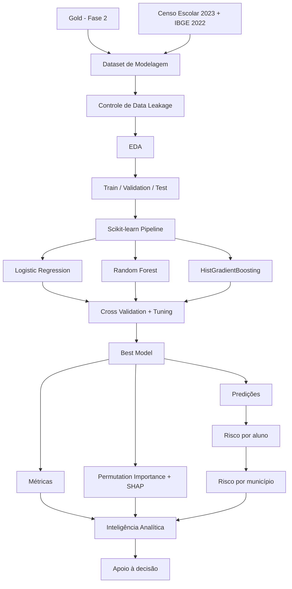

# FIAP AI Scientist — Tech Challenge Fase 3

Aluno: Augusto César Monteegro e Silva

Link para o video: 

## Predição e Inteligência Analítica para Alfabetização no Brasil

Este projeto dá continuidade à pipeline de engenharia de dados construída na Fase 2 e desenvolve uma solução de Machine Learning para apoiar a análise do risco de não alfabetização no Brasil.

A solução utiliza dados da Avaliação da Alfabetização do INEP, enriquecidos com informações do Censo Escolar 2023 e do IBGE 2022. O pipeline foi estruturado para preservar rastreabilidade, reduzir risco de data leakage, integrar pré-processamento e modelagem e produzir resultados interpretáveis para apoio à tomada de decisão.

---

## 1. Objetivo analítico

O objetivo principal é construir um modelo supervisionado capaz de estimar a probabilidade de um aluno pertencer à classe de risco de não alfabetização.

O target final utilizado é:

```text
risco_nao_alfabetizado

1 = aluno não alfabetizado
0 = aluno alfabetizado
```

Ele é derivado de `alfabetizado_oficial`.

O projeto também busca responder perguntas analíticas como:

- Quais fatores estão mais associados ao risco de não alfabetização?
- Quais características educacionais e territoriais apresentam maior importância preditiva?
- Qual é a contribuição do contexto municipal para a classificação?
- O desempenho do modelo depende excessivamente da identidade da UF?
- Como as probabilidades previstas podem ser agregadas para produzir indicadores exploratórios de risco municipal?

---

## 2. Arquitetura da solução

```text
                 DATA / GOLD
                     +
              FONTES EXTERNAS
               /           \
      Censo Escolar        IBGE
               \           /
                    ↓
          DATASET DE MODELAGEM
                    ↓
          CONTROLE DE LEAKAGE
                    ↓
                   EDA
                    ↓
        TRAIN / VALIDATION / TEST
                    ↓
             PREPROCESSING
                    ↓
       ┌────────────┼────────────┐
       ↓            ↓            ↓
   Logistic      Random      HistGradient
  Regression      Forest       Boosting
       └────────────┼────────────┘
                    ↓
         CROSS VALIDATION
                    ↓
              BEST MODEL
             /     |      \
            ↓      ↓       ↓
       Métricas   SHAP   Predições
                            ↓
                   Risco por aluno
                            ↓
                   Risco por município
                            ↓
                 POLÍTICA PÚBLICA
```

Versão Mermaid:



---

## 3. Fontes de dados

### 3.1 Avaliação da Alfabetização — INEP

Fonte principal do target e dos indicadores educacionais.

Arquivos utilizados na Fase 2:

```text
resultados_e_metas_ufs_2024_2.xlsx
resultados_e_metas_municipios_2024.xlsx
microdados_avaliacao_da_alfabetizacao_2024.zip
```

### 3.2 Censo Escolar 2023 — INEP

Usado para enriquecer o dataset com indicadores de infraestrutura e contexto educacional.

A tentativa de relacionamento entre `id_escola` da Avaliação da Alfabetização e `CO_ENTIDADE` do Censo Escolar não apresentou correspondências. Por isso, a integração foi realizada no nível municipal:

```text
Censo Escolar.CO_MUNICIPIO
             ↓
Gold.codigo_municipio
```

O Censo Escolar foi agregado por município antes da modelagem.

### 3.3 IBGE 2022

Utilizado para incorporar contexto demográfico, territorial e socioeconômico, incluindo:

```text
populacao_2022
pct_urbana_2022
pib_per_capita_2022
UF e divisões territoriais
```

---

## 4. Pipeline de dados

A Fase 2 utiliza arquitetura Medalhão:

```text
Bronze → Silver → Gold
```

### Bronze

Preserva os dados próximos à fonte original.

### Silver

Executa limpeza, padronização, conversão de tipos, remoção de duplicidades e validações.

### Gold

Produz datasets analíticos, incluindo:

```text
gold_amostra_alunos.csv
gold_indicadores_municipios.csv
gold_indicadores_ufs.csv
gold_evolucao_temporal_municipal.csv
gold_resumo_municipal_por_uf.csv
```

---

## 5. Dataset de modelagem

A base inicial integrada possui:

```text
5.000 alunos
68 colunas
```

Após a etapa de seleção e curadoria de features:

```text
5.000 alunos
37 colunas totais
31 features efetivas
```

Distribuição do target:

| Classe | Quantidade | Percentual |
|---|---:|---:|
| 0 — sem risco | 2.618 | 52,36% |
| 1 — risco | 2.382 | 47,64% |

A distribuição é relativamente equilibrada, portanto não foi necessário aplicar oversampling ou undersampling.

Os valores ausentes relevantes ficaram concentrados em:

| Variável | Missing |
|---|---:|
| `pct_alfabetizados_2023` | 10,56% |
| `meta_2024` | 10,56% |

A imputação é realizada dentro da pipeline de Machine Learning.

---

## 6. Seleção de features e prevenção de data leakage

A prevenção de leakage foi tratada explicitamente.

Variáveis excluídas do modelo incluem:

```text
proficiencia_lp
alfabetizado_oficial
alfabetizado_calculado_743
divergencia_indicador_743
pct_alfabetizados_2024
variacao_2023_2024_pp
gap_meta_2024_pp
atingiu_meta_2024
rankings derivados de 2024
nivel_alfabetizacao
```

Também foram excluídas do conjunto de features:

```text
id_aluno
id_escola
codigo_municipio
nome_municipio
peso_aluno_lp
presenca_lp
preenchimento_lp
codigo_caderno_lp
```

`id_escola` permanece apenas como variável de agrupamento para a estratégia de validação.

Variáveis constantes, como `ano_avaliacao` e `tipo_serie`, também foram removidas.

A curadoria reduziu ainda redundâncias geográficas e demográficas, como percentuais complementares urbano/rural e múltiplos códigos territoriais de alta cardinalidade.

---

## 7. Features utilizadas

### Educacionais

```text
tipo_dependencia
pct_alfabetizados_2023
meta_2024
```

### Infraestrutura escolar municipal

Exemplos:

```text
numero_escolas
pct_escolas_urbanas
pct_escolas_estaduais
pct_escolas_municipais
pct_escolas_privadas
pct_escolas_internet
pct_escolas_banda_larga
pct_escolas_biblioteca_ou_sala_leitura
pct_escolas_lab_informatica
pct_escolas_agua_potavel
pct_escolas_energia_rede_publica
pct_escolas_esgoto_rede_publica
pct_escolas_coleta_lixo
pct_escolas_quadra_esportes
pct_escolas_refeitorio
media_salas_utilizadas
media_equip_multimidia
media_desktop_aluno
media_notebook_aluno
media_tablet_aluno
```

### Contexto territorial e socioeconômico

```text
sigla_uf
populacao_2022
pct_urbana_2022
pib_per_capita_2022
```

---

## 8. EDA — Análise Exploratória de Dados

A EDA foi utilizada para avaliar:

- distribuição do target;
- valores ausentes;
- cardinalidade;
- variáveis constantes;
- correlações numéricas;
- comportamento por UF;
- cobertura das integrações externas;
- consistência do dataset de modelagem.

As figuras e tabelas produzidas são armazenadas em:

```text
Data/images
Data/reports
```

---

## 9. Pré-processamento

O pré-processamento é integrado diretamente ao modelo com `Pipeline` e `ColumnTransformer` do Scikit-learn.

### Variáveis numéricas

```text
SimpleImputer(strategy="median")
StandardScaler()
```

O `StandardScaler` é utilizado no modelo linear.

### Variáveis categóricas

```text
SimpleImputer(strategy="most_frequent")
OneHotEncoder(handle_unknown="ignore")
```

Para o HistGradientBoosting é utilizada codificação ordinal na pipeline correspondente.

---

## 10. Estratégia de validação

Para reduzir vazamento entre registros relacionados, a validação utiliza:

```text
StratifiedGroupKFold
```

com:

```text
group = id_escola
```

O `id_escola` não entra como feature.

A separação final mantém aproximadamente 20% dos dados como holdout, usando a mesma lógica de grupos e estratificação.

---

## 11. Modelos comparados

Foram avaliados três classificadores:

- Logistic Regression;
- Random Forest;
- HistGradientBoosting.

### Resultados de cross-validation

| Modelo | Accuracy | Balanced Accuracy | Recall | F1 | ROC-AUC | PR-AUC |
|---|---:|---:|---:|---:|---:|---:|
| Logistic Regression | 0,609 | 0,609 | 0,602 | 0,595 | 0,647 | **0,609** |
| Random Forest | 0,584 | 0,583 | 0,562 | 0,563 | 0,606 | 0,564 |
| HistGradientBoosting | 0,576 | 0,573 | 0,517 | 0,537 | 0,601 | 0,562 |

A Logistic Regression apresentou o melhor desempenho médio na validação cruzada, principalmente em PR-AUC e ROC-AUC.

---

## 12. Modelo selecionado

O modelo final selecionado foi:

```text
Logistic Regression
```

Melhor hiperparâmetro encontrado:

```text
C = 0.1833
```

A escolha de um modelo linear também favorece interpretabilidade e reduz complexidade desnecessária para a amostra disponível.

---

## 13. Resultado no conjunto de teste

| Métrica | Resultado |
|---|---:|
| Accuracy | 0,566 |
| Balanced Accuracy | 0,565 |
| Precision — risco | 0,545 |
| Recall — risco | 0,547 |
| F1 — risco | 0,546 |
| ROC-AUC | 0,611 |
| PR-AUC | 0,565 |

Os resultados indicam **capacidade preditiva moderada**. O modelo supera uma classificação puramente aleatória em métricas de ranking, mas ainda apresenta limitações importantes para uso operacional.

Por esse motivo, o modelo deve ser interpretado como uma prova de conceito analítica e não como mecanismo autônomo de decisão individual.

---

## 14. Interpretabilidade

Foram implementadas duas abordagens:

```text
Permutation Importance
SHAP Values
```

### Principais variáveis segundo SHAP

| Posição | Feature | Mean \|SHAP\| |
|---:|---|---:|
| 1 | `sigla_uf` | 0,627 |
| 2 | `pct_alfabetizados_2023` | 0,427 |
| 3 | `tipo_dependencia` | 0,130 |
| 4 | `pct_escolas_lab_informatica` | 0,121 |
| 5 | `meta_2024` | 0,098 |
| 6 | `pct_escolas_coleta_lixo` | 0,096 |
| 7 | `media_salas_utilizadas` | 0,085 |
| 8 | `pct_escolas_urbanas` | 0,078 |
| 9 | `populacao_2022` | 0,073 |
| 10 | `pct_urbana_2022` | 0,069 |

Essas importâncias indicam associação preditiva, não relação causal.

O destaque de `sigla_uf` motivou uma análise adicional de robustez.

---

## 15. Teste de robustez sem `sigla_uf`

Foi treinada uma versão do mesmo modelo removendo apenas `sigla_uf`, mantendo a mesma lógica de divisão e os mesmos hiperparâmetros.

| Métrica | Com UF | Sem UF | Diferença |
|---|---:|---:|---:|
| Accuracy | 0,566 | 0,579 | +0,013 |
| Balanced Accuracy | 0,565 | 0,580 | +0,015 |
| Precision — risco | 0,545 | 0,554 | +0,010 |
| Recall — risco | 0,547 | 0,597 | +0,050 |
| F1 — risco | 0,546 | 0,575 | +0,029 |
| ROC-AUC | 0,611 | 0,603 | -0,009 |
| PR-AUC | 0,565 | 0,547 | -0,018 |

A retirada da UF não destruiu o desempenho do modelo. Accuracy, balanced accuracy, recall e F1 melhoraram, enquanto ROC-AUC e PR-AUC apresentaram quedas pequenas.

Isso sugere que, embora `sigla_uf` apresente grande importância no SHAP, o modelo não depende exclusivamente da identidade do estado. Parte relevante do sinal permanece presente nas características educacionais, de infraestrutura e socioeconômicas.

O modelo principal foi mantido para a comparação formal, enquanto a versão sem UF é apresentada como teste de robustez e evidência de que o desempenho não decorre apenas de memorização territorial.

---

## 16. Risco municipal

As probabilidades produzidas no holdout foram agregadas por município.

São gerados:

```text
Data/reports/risco_municipal_todos.csv
Data/reports/ranking_risco_municipal.csv
```

O ranking exige um número mínimo de observações no conjunto de teste e deve ser interpretado como:

```text
ranking exploratório de risco na amostra
```

Ele não representa um ranking oficial dos municípios brasileiros.

---

## 17. Principais insights

Os resultados sugerem que:

1. o histórico educacional municipal de 2023 possui forte valor preditivo;
2. o contexto territorial aparece associado às diferenças de risco;
3. dependência administrativa apresenta importância relevante;
4. indicadores de infraestrutura escolar também contribuem para a classificação;
5. a remoção da UF não elimina a capacidade preditiva;
6. nenhuma das associações deve ser interpretada como efeito causal.

---

## 18. Limitações

### Tamanho da amostra

A modelagem utiliza uma amostra de 5.000 alunos, e não o universo completo dos microdados.

### Granularidade externa

O Censo Escolar foi integrado no nível municipal. Assim, seus indicadores representam o contexto educacional municipal, e não necessariamente a escola específica frequentada pelo aluno.

### Histórico temporal

O histórico disponível é curto e não sustenta uma previsão temporal robusta de longo prazo até 2030.

### Capacidade preditiva

O desempenho no holdout é moderado. O modelo não deve ser utilizado isoladamente para decisões individuais.

### Associação não implica causalidade

SHAP, coeficientes e feature importance descrevem comportamento do modelo. Eles não demonstram que determinada variável causa alfabetização ou não alfabetização.

### Uso responsável

O modelo deve apoiar análise agregada e geração de hipóteses, sempre acompanhado de avaliação humana e análise educacional contextual.

---

## 19. Aplicação prática

A solução pode apoiar gestores em tarefas como:

- identificar contextos associados a maior risco;
- priorizar investigação de municípios ou regiões;
- comparar padrões territoriais;
- formular hipóteses sobre infraestrutura e resultados;
- direcionar estudos complementares;
- apoiar desenho de políticas públicas baseadas em evidências.

O modelo deve ser utilizado como componente de inteligência analítica, e não como sistema automático de decisão sobre alunos.

---

## 20. Estrutura principal do projeto

```text
techallenge1
│
├── .venv
├── download_external_data.py
├── build_modeling_dataset.py
├── prepare_ml_features.py
├── inspect_modeling_data_ml.py
├── eda_fase3.py
├── train_ml.py
├── explain_ml.py
├── aggregate_risk.py
├── robustez_sem_sigla_uf.py
├── run_ml_pipeline.py
├── requirements_ml.txt
│
└── Data
    ├── Bronze
    ├── Silver
    ├── Gold
    ├── External
    ├── Modeling
    ├── models
    ├── reports
    ├── images
    ├── logs
    └── src
```

---

## 21. Como executar

### Ativar o ambiente

```powershell
cd "G:\Meu Drive\FIAP\AI_Scientist\Fase3\techallenge1"
.\.venv\Scripts\Activate.ps1
```

### Instalar dependências

```powershell
python -m pip install -r requirements_ml.txt
```

### Coletar/enriquecer dados externos

```powershell
python download_external_data.py
```

### Construir dataset integrado

```powershell
python build_modeling_dataset.py
```

### Curar as features

```powershell
python prepare_ml_features.py
```

### Inspecionar

```powershell
python inspect_modeling_data_ml.py
```

### EDA

```powershell
python eda_fase3.py
```

### Treinar e selecionar modelo

```powershell
python train_ml.py
```

### Interpretabilidade

```powershell
python explain_ml.py
```

### Risco municipal

```powershell
python aggregate_risk.py
```

### Robustez sem UF

```powershell
python robustez_sem_sigla_uf.py
```

---

## 22. Principais artefatos

### Dataset

```text
Data/Modeling/dataset_modelagem_ml.csv
```

### Modelo

```text
Data/models/best_model.joblib
Data/models/model_metadata.json
```

### Métricas

```text
Data/reports/metricas_modelos_cv.csv
Data/reports/metricas_teste_final.csv
Data/reports/robustez_sem_sigla_uf.csv
```

### Interpretabilidade

```text
Data/reports/permutation_importance.csv
Data/reports/shap_importance.csv
```

### Predições e risco municipal

```text
Data/reports/predictions_test.csv
Data/reports/risco_municipal_todos.csv
Data/reports/ranking_risco_municipal.csv
```

---

## 23. Reprodutibilidade

O projeto utiliza:

```text
RANDOM_SEED = 42
```

A pipeline mantém:

- transformação de dados integrada ao modelo;
- imputação apenas dentro da pipeline;
- separação por grupos;
- validação cruzada;
- holdout final;
- hiperparâmetros registrados;
- modelo serializado;
- metadados da execução.

---

## 24. Conclusão

A solução demonstra uma pipeline completa de Ciência de Dados aplicada à alfabetização: parte de dados públicos, integra múltiplas fontes, trata leakage, realiza EDA, compara modelos, valida generalização, interpreta as previsões e transforma probabilidades individuais em indicadores exploratórios de risco municipal.

A Logistic Regression apresentou o melhor desempenho entre os algoritmos avaliados, com PR-AUC médio de 0,609 na validação cruzada e PR-AUC de 0,565 no holdout. O teste de robustez sem `sigla_uf` mostrou que o modelo preserva desempenho relevante mesmo sem a principal feature territorial apontada pelo SHAP.

Os resultados são suficientemente informativos para uma prova de conceito acadêmica e para apoiar investigação analítica, mas ainda não justificam uso autônomo em decisões individuais. Evoluções futuras devem ampliar o volume e a riqueza dos dados, incorporar histórico temporal mais longo, testar generalização geográfica explícita e aprofundar avaliações de fairness e calibração.
